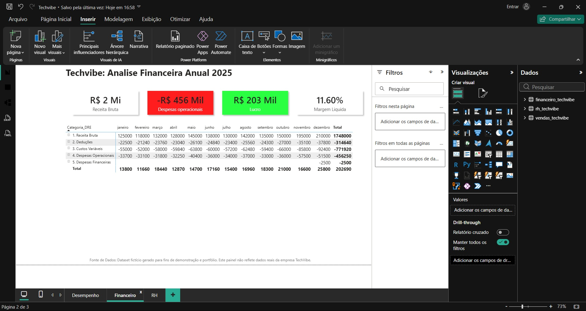
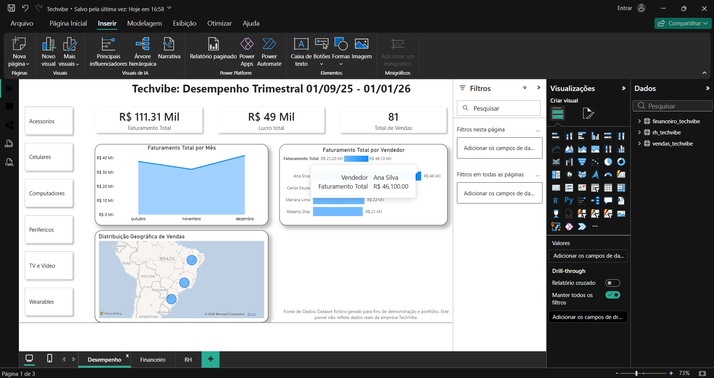
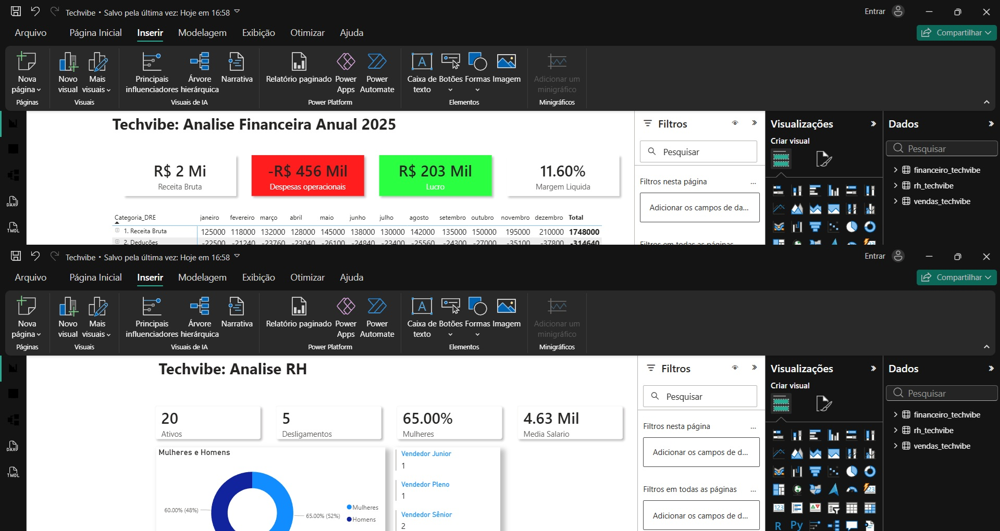

# techvibe-business-intelligence
Suíte completa de Gestão Corporativa (Vendas, Financeiro e RH) desenvolvida no Microsoft Power BI. Demonstração de modelagem de dados, DAX avançado e Storytelling para tomada de decisão estratégica.

# 📊 TechVibe 360º - Solução de Business Intelligence Corporativo

> **Status:** Concluído ✅ | **Ferramenta:** Microsoft Power BI

## 🎯 Visão Geral do Projeto
Este projeto consiste em uma suíte completa de Business Intelligence desenvolvida para a **TechVibe** (empresa fictícia do setor de varejo de eletrônicos). O objetivo foi transformar dados brutos de diferentes departamentos em painéis visuais para tomada de decisão estratégica.

O projeto simula um cenário real de consultoria, cobrindo os três pilares fundamentais de gestão: **Vendas (Comercial), Lucratividade (Financeiro) e Gestão de Pessoas (RH).**

---

## 📱 Módulo 1: Gestão Comercial & Vendas
Focado em maximizar a receita e identificar padrões de consumo. Permite ao gestor monitorar o desempenho por vendedor, categoria de produto e geografia.

*(Substitua esta linha pelo print do seu dashboard de Vendas)*

### 🔍 Principais Insights & KPIs:
* **Faturamento Total e Volume de Vendas:** Visão macro do desempenho trimestral.
* **Ranking de Vendedores:** Utilizei **Formatação Condicional** para destacar automaticamente o top performer (Ana Silva), facilitando a gestão visual.
* **Análise Geográfica:** Mapa interativo cruzando Região e Volume de Vendas.
* **Sazonalidade:** Gráfico de área para identificar tendências de queda ou pico no mês a mês.

---

## 💰 Módulo 2: Visão Financeira (DRE Gerencial)
Focado na saúde financeira da empresa. Diferente do módulo de vendas, este painel cruza receitas com custos fixos e variáveis para revelar o **Lucro Líquido Real**.

*(Substitua esta linha pelo print do seu dashboard Financeiro)*

### 🔍 Principais Insights & KPIs:
* **Margem Líquida Real:** Monitoramento da eficiência do negócio (Resultado: ~11%).
* **Estrutura de DRE (Demonstração do Resultado):** Visualização em Matriz hierárquica permitindo "drill-down" (detalhamento) das contas.
* **Ofensores de Custo:** Identificação rápida de onde o dinheiro está sendo gasto (Marketing, Folha, Impostos).

---

## 👥 Módulo 3: People Analytics (RH)
Focado na retenção de talentos e diversidade. Monitora o ciclo de vida do colaborador na empresa.

*(Substitua esta linha pelo print do seu dashboard de RH)*

### 🔍 Principais Insights & KPIs:
* **Headcount Ativo:** Monitoramento em tempo real do quadro de funcionários.
* **Turnover (Rotatividade):** Cálculo via DAX para medir a taxa de saída de colaboradores.
* **Diversidade:** Indicador de % de Mulheres na liderança e na empresa.
* **Top Cargos:** Gráfico de ranking para identificar as maiores equipes.

---

## 🛠️ Tecnologias e Habilidades Aplicadas

* **ETL (Power Query):** Limpeza e tratamento de bases CSV despadronizadas, tipagem de dados e criação de colunas condicionais (ex: "Localização Completa").
* **Modelagem de Dados:** Criação de Relacionamentos (Star Schema) e tabela dCalendar (se aplicável).
* **Linguagem DAX:**
    * Criação de Medidas explícitas (SUM, DIVIDE, CALCULATE).
    * Inteligência de Tempo e Funções Lógicas (IF, BLANK).
    * Funções de Contagem (COUNTROWS) para métricas de RH.
* **Design & UX:**
    * Layout Grid com Fundo Cinza e Cartões (Shadow Effect).
    * Segmentação de Dados moderna (Botões estilo App).
    * Storytelling com cores semânticas (Azul Corporativo).

---

## ⚠️ Disclaimer
*Os dados apresentados neste projeto (nomes de funcionários, valores financeiros e transações) são **fictícios**, gerados exclusivamente para fins de estudo e demonstração de portfólio, respeitando as normas da LGPD.*

---

### 📬 Contato
Gostou do projeto? Estou disponível para projetos de consultoria e análise de dados.

* **LinkedIn:** https://www.linkedin.com/in/andre-de-campos-moreira-b80770241/
* **E-mail:** andrecm.pessoal@gmail.com
